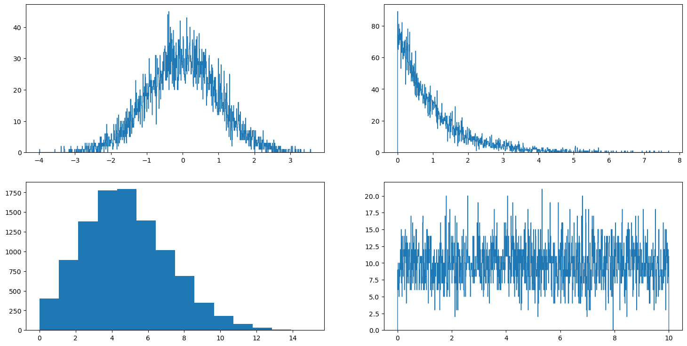
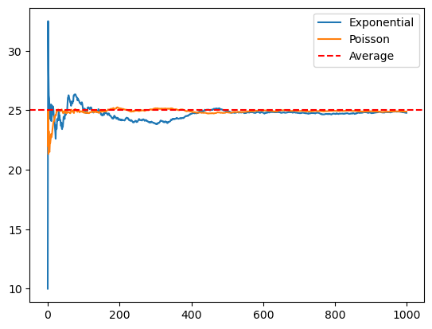

난수 생성
=====
지난 코딩 내실 스터디에서 난수생성에 관한 몇몇 예시들을 알아보았습니다.<br>
그런데 코드를 구현할 때, 여러 분포를 따르는 난수를 생성해야 하는 일이 있을 겁니다.(아마도)<br>
그래서 이번 과제에는 다양한 난수 생성에 관해 알아보기로 하겠습니다. 이번에도 편하게 읽어보시면 될 거 같습니다.<br><br>
주의! 엄청 깁니다. 천천히 읽어보세요.
## What If
먼저 파이썬을 먼저 살펴보겠습니다. 가장 기본적인 난수 생성은 ```random```을 사용하는 것입니다.
```python
import random as rd ## 랜덤 라이브러리 import

a = rd.randint(1, 10)        ## [1, 10] 공간에서 난수 추출 a = int
b = rd.random()              ## (0, 1) 공간에서 난수 추출 b = float

data = [ i for i in range(1, 11)]

c = rd.choice(data)          ## list 내에서 랜덤추출
d = rd.sample(data, 4)       ## list 내에서 랜덤으로 n개 추출 d = list
e = rd.shuffle(data)         ## list를 랜덤으로 섞는다. list 자체를 바꿈
```
여기서 rd.choice를 사용할때, list만 사용가능할까요? set이나 tuple, dictionary 내에서 랜덤으로 추출 하는 것은 가능할까요? 직접 한 번 해봅시다.

추가적으로 ```random.choices()```를 사용하면 가중치, 즉 확률을 부여해서 추출도 가능합니다. 이 때 주의해야할 점은 data와 weight의 요소의 갯수가 같아야 합니다. 그런데 weights의 합은 당연히 1이 되야 할거라 생각했는데, 아니어도 실행은 되네요.
```
weight = [0.1, 0.09, 0.1, 0.11, 0.1, 0.08, 0.07, 0.12, 0.13, 0.1]
c_weights = rd.choices(data, weights=weight)
```
스터디 시간에는 uniform distribution만 해보았지만, 사실 존재하는 대다수의 분포를 따르는 난수 생성 메서드가 존재합니다. Exponential, Normal distribution 등이 있는데, Poisson distribution은 없습니다. 그렇다면 Poisson distribution을 따르는 난수는 어떻게 생성해야 할까요?<br>
그럴 때에는 Numpy를 사용해서 생성해야합니다. ```numpy.random.poisson(lam)```을 사용하면 됩니다.<br>
먼저 Numpy를 사용하려면, Terminal의 CMD에서 pip install numpy를 입력해서 설치를 해야합니다. 그 이후 코드 블록에 ```import numpy as np```를 입력해서 사용하면 됩니다.

```python
import numpy as np
import random as rd

a_rd = rd.gauss(mean, sigma)        
a_np = np.random.standard_normal(n)        ## n만큼의 값 return

b_rd = rd.expovariate(lam)
b_np = np.random.exponential(lam, n)

c_np = np.random.poisson(lam, n)
```
Numpy를 사용하면 난수 생성을 원하는 갯수만큼 쉽게 할 수 있다는 장점이 있습니다.<br>
또한 random Library보다 더욱 많은 메서드를 바탕으로 다양한 작업을 수행할 수 있습니다. 앞서 random에서 사용했던 ```random.choices()```, ```random.shuffle()```과 같은 메서드또한 당연히 Numpy에서 사용가능합니다.

```python
import numpy as np

data = np.random.choice(a, n, p=[0.1, 0.2, 0.3, 0.4])
```
a는 Numpy array나 int형을 받아서 수행합니다. int를 받으면 알아서 np.arrange(a)로 만들어서 사용합니다. n은 반환 값의 갯수고, p는 확률입니다. 이때 당연하게도 확률값은 a의 size와 동일해야하고, 합은 1이 되어야 합니다.
```python
import numpy as np

x = np.arrange(10)
y = [i for i in range(1, 11)]

np.random.shuffle(x)
np.random.shuffle(y)
```
```np.random.shuffle()```의 경우 Numpy array나 Mutable Sequence를 입력을 사용가능합니다. Mutable이니까 tuple은 사용불가능 하겠죠? 그러면 set은 사용가능할까요?

Numpy에 대한 소개는 이정도면 될 것 같습니다. 이외에도 많은 메서드들이 있는데, 그것들은 외울 필요도 없고 구글링 잘 해서 그때 그떄 적용해서 사용하시면 됩니다. 열심히 적어놓고 이런말 하기 뭐 하지만, 위에 내용들도 구글링 해서 사용하시면 됩니다...

그렇다면 C++에서는 다양한 분포를 어떻게 생성할까요?<br>
스터디에서 배웠던 random library를 이용하면 됩니다.
```cpp
#include <random>
using namespace std;

int main(){

    random_device rd;
    mt19937 gen(rd());

    uniform_int_distribution<> uni(0, 10);
    poisson_distribution<> poi(3);
    exponential_distribution<> exp(0.5);
    normal_distribution<> nor(0, 1);

    int a = uni(gen);
    int b = poi(gen);
    float c = exp(gen);
    float d = nor(gen);
    
    return 0;
}
```
C++에서는 변수를 선언할 때 자료형을 같이 선언해야 하므로, 어떤 분포의 결과가 어떤 자료형으로 return되는 지 잘 알고 변수를 선언해야 합니다.<br>

그렇다면 Python에서 사용했던 ```random.shuffle()```, ```random.choice()```와 같은 함수는 C++에서 어떻게 사용할까요?

```cpp
#include <random>
#include <algorithm>
#include <vector>
using namespace std;

int main(){

    random_device rd;
    mt19937 gen(rd());

    vector<int> v={1, 2, 3, 4, 5, 6, 7, 8, 9, 10};
    vector<int> v_new;
 
    shuffle(v.begin(), v.end(), gen);
    sample(v.begin(), v.end(), back_inserter(v_new), 5, gen);

    return 0;   

}
```
이렇게 사용하면 됩니다.<br>
쓰다 보니 엄청 길어졌는데, 이해하기 힘든 내용은 아니니 천천히 읽어보세요. Python이던, C++이던 언젠가 사용하실 일이 있을겁니다.<br>
혹시 사용하실 일이 없으실까봐 문제를 바로 풀어보죠?

## 문제 1.
직접 특정 분포를 따르는 랜덤 난수를 추출해보고, 그 결과를 시각화 해서 실제 그 분포와 비슷한지 한번 비교해볼까요?<br>
결과를 보시려면 데이터를 시각화 해주는 matplotlib이 필요하니, CMD 터미널에서 pip install matplotlib을 입력하셔서 라이브러리를 다운받아주세요.<br>
익숙하지 않은 라이브러리 matplotlib을 사용하는 부분은 제가 가이드로 다 드릴거고, 중간에 데이터를 생성하는 부분을 채워주시면 됩니다.<br>
C++에도 matplotlib이 있긴 하지만, Python에서 진행해주세요!

```python
import numpy as np
import matplotlib.pyplot as plt

num_of_samples = 10000

### standard distribution
std = ## enter your code

### exponential distribution
exp = ## enter your code, lambda = 1

### poisson distribution
poi = ## enter your code, lambda = 5

### uniform distribution
uni = ## enter your code

plt.figure(figsize=(18,9))
plt.subplot(2,2,1)
plt.hist(std, bins=1000, histtype="step")
plt.subplot(2,2,2)
plt.hist(exp, bins=1000, histtype="step")
plt.subplot(2,2,3)
plt.hist(poi, bins=14)
plt.subplot(2,2,4)
plt.hist(uni, bins=1000, histtype="step")
plt.show()
```
### 결과


## 문제 2. (심화)
포아송 분포와 지수 분포는 밀접한 연관을 가지고 있습니다. 확률과정을 수강하셨으면 어떤 연관을 가지고 있는 지 잘 아실테지만 그렇지 않으신 분도 계실겁니다. 요약하자면, 지수 분포는 사건이 발생하는 시간 간격에 관한 분포이고, 포아송 분포는 사건의 발생 횟수에 관한 분포입니다.<br>
포아송 분포는 Lambda를 매개변수로 받는데, 이 Lambda는 사건 발생 횟수의 기댓값입니다. 즉, lambda = 5 일경우 단위시간동안 사건의 발생 횟수의 평균이 5회라는 겁니다.<br>
지수분포의 경우 lambda=5일 경우 사건 발생 대기 시간의 기댓값은 1/lambda로 0.2초가 됩니다.<br>

위 사실을 바탕으로 포아송 분포를 따르는 사건의 발생 횟수와, 지수 분포를 통해 얻은 시간 간격을 가공해서 단위 시간당 사건 발생 횟수를 비교해볼 수 있을 것입니다. 이론상으로는 두 분포를 따르는 사건 발생 횟수는 수렴해야 할 것입니다. 실제로 수렴할까요?

lambda = 5라 가정하면 5분동안 사건이 발생할 확률의 기댓값은 25회입니다. 실제로 포아송 분포를 iter의 수만큼 반복하면서 포아송 분포를 따르는 평균 사건 발생횟수를 return하는 ```poisson()```함수를 참고해서 지수분포를 따르는 평균 사건 발생 횟수를 return하는 함수 ```exponential()```을 작성해봅시다.
<details>
<summary>아무런 생각이 나지 않는다면 참고하세요</summary>
<div markdown="1">

먼저 ```poisson()``` 함수처럼 매 스텝마다 지수분포를 따르는 발생 횟수를 생성하고, 그 값의 평균을 스텝마다 저장하는 기능을 해야 할 것입니다.<br>
문제가 되는 것은 스텝마다 지수 분포를 따르는 발생 횟수를 생성하는 방법인데, 앞서 말했듯, 지수분포는 사건의 발생시간간격의 분포입니다. 그렇다면 그 시간 간격의 합을 바탕으로 step마다 사건의 발생 횟수가 몇 회인지 판단하면 되겠죠?

</div>
</details>
<br>

```python
import numpy as np
import matplotlib.pyplot as plt

def poisson(lam, iter, time):

    poisson_list = []
    poisson_avg = []

    for step in range(iter):
        poisson_list.append(np.random.poisson(lam)*time)
        poisson_avg.append(sum(poisson_list)/(step+1))

    return poisson_avg
        

def exponential(lam, iter, time):
    
    exp_list = []
    exp_avg = []

    ## enter your code

    return exp_avg


def draw_graph(exp_avg, poisson_avg):

    plt.plot(exp_avg, label='Exponential')
    plt.plot(poisson_avg, label='Poisson')
    plt.axhline(25, color='red', linestyle='--', label='Average')
    plt.legend()
    plt.show()

lamb = 5
time = 5
iter = 1000

poi = poisson(lamb, iter, time)
exp = exponential(lamb, iter, time)
draw_graph(poi, exp)
```
### 결과


## 문제1 정답코드
```python
import numpy as np
import matplotlib.pyplot as plt

### standard distribution
std = np.random.standard_normal(10000)

### exponential distribution
exp = np.random.exponential(1, 10000)

### poisson distribution
poi = np.random.poisson(5, 10000)

### uniform distribution
uni = np.random.uniform(0, 10, 10000)

plt.figure(figsize=(18,9))
plt.subplot(2,2,1)
plt.hist(std, bins=1000, histtype="step")
plt.subplot(2,2,2)
plt.hist(exp, bins=1000, histtype="step")
plt.subplot(2,2,3)
plt.hist(poi, bins=14)
plt.subplot(2,2,4)
plt.hist(uni, bins=1000, histtype="step")
plt.show()
```

## 문제2 정답코드
```python
import numpy as np
import matplotlib.pyplot as plt

def poisson(lam, iter, time):

    poisson_list = []
    poisson_avg = []

    for step in range(iter):
        poisson_list.append(np.random.poisson(lam)*time)
        poisson_avg.append(sum(poisson_list)/(step+1))

    return poisson_avg
        

def exponential(lam, iter, time):
    
    exp_list = []
    exp_avg = []

    for step in range(iter):
        init_time = 0
        count = 0
        while True:
            exp_time = np.random.exponential(1/lam)
            init_time += exp_time
            if init_time > time:
                break
            else:
                count+=1

        exp_list.append(count)
        exp_avg.append(sum(exp_list)/(step+1))

    return exp_avg


def draw_graph(exp_avg, poisson_avg):

    plt.plot(exp_avg, label='Exponential')
    plt.plot(poisson_avg, label='Poisson')
    plt.axhline(25, color='red', linestyle='--', label='Average')
    plt.legend()
    plt.show()

lamb = 5
time = 5
iter = 1000

poi = poisson(lamb, iter, time)
exp = exponential(lamb, iter, time)
draw_graph(poi, exp)
```
