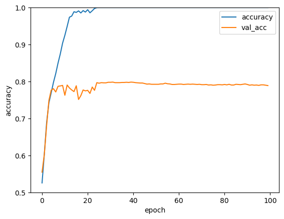
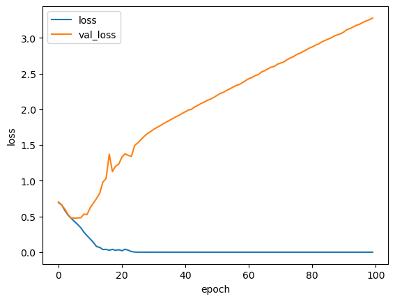

# Dog Or Cat

## 개와 고양이를 구분하는 CNN 구현
###  데이터 전처리
<br>

kaggle의 데이터셋 사용 [(kaggle)]( https://www.kaggle.com/datasets/tongpython/cat-and-dog)

zipfile 모듈을 이용해 압축파일 해제
```python
import zipfile

test_set=zipfile.ZipFile('test_set.zip')
training_set=zipfile.ZipFile('training_set.zip')
test_set.extractall()
training_set.extractall()
```
<br>

#### 전처리 시 생각해야할 점 

<br>

1. zipfile을이용하여 압축해제한 이미지들은 size가 고르지 않기에 ```cv2.resize()```를 이용하여 이미지의 크기를 일정하게 변경해야한다.

2. 데이터셋의 이미지를 ```cv2.imread()```로 불러올 경우 ```(height, wide, 3)```의 3차원 넘파이 어레이로 반환한다. 3은 RGB값을 나타낸다. 만약 흑백으로 read할 경우는 1이 될 것이다. 또한 RGB의 값은 0~255의 값이므로, 활성화 함수를 사용할 경우 Vanishing Gradient 문제가 발생할 수 있으므로 /255를 하여 데이터를 0~1의 값으로 Scailing 해주어야 한다.

3. 불러온 이미지의 정답표인 one-hot vector를 만들어줘야한다.

4. return 값은 ```test_set```의 전처리된 이미지와 One-hot Vector와 ```train_set```의 전처리된 이미지와 One-hot Vector이다. 즉 1*4 list가 return될 것이다. 

<br>

#### 코드 구현
```python
import cv2
import matplotlib.pyplot as plt
import numpy as np
import tensorflow as tf
from keras import datasets, layers, models

height=64 #이미지 크기 64*64
wide=64
num_of_answer=2 # 정답의 갯수 (개, 고양이에 대한 CNN 이므로 두 가지)

def load_data():

    test_list=test_set.namelist()
    test_count=0

    for file in test_list:
        if 'jpg' in file:
            test_count+=1

    test_x=np.zeros((test_count,height,wide,3)) #(2023, 64, 64, 3)
    test_y=np.zeros((test_count,num_of_answer)) #(2023, 2)

    test_count=-1

    for test in test_list:
        if 'jpg' in test:
            test_count+=1 
            test=test.replace("\\",'/',10)
            test_img=cv2.imread('C:/Users/aid08/Desktop/reinf/Proj_Dog_Or_Cat/'+ test)
            test_img=cv2.resize(test_img, dsize=(height,wide))
            test_x[test_count]=test_img
            if 'cat' in test:
                test_y[test_count][0]=1
            elif 'dog' in test:
                test_y[test_count][1]=1
    
    training_list=training_set.namelist()     
    train_count=0

    for training in training_list: 
        if 'jpg' in training:
            train_count+=1

    train_x=np.zeros((train_count,height,wide,3)) #(8005, 64, 64, 3)
    train_y=np.zeros((train_count,num_of_answer)) #(8005, 2)

    train_count=-1

    for train in training_list:
        if 'jpg' in train:
            train_count+=1
            train=train.replace("\\",'/',10)
            train_img=cv2.imread('C:/Users/aid08/Desktop/reinf/Proj_Dog_Or_Cat/'+ train)
            train_img=cv2.resize(train_img, dsize=(height,wide))
            train_x[train_count]=train_img
            if 'cat' in train:
                train_y[train_count][0]=1
            elif 'dog' in train:
                train_y[train_count][1]=1

    return [train_x/255, train_y, test_x/255, test_y]


train_X, train_Y, test_X, test_Y = load_data()
```

#### 생각해볼 점
1. ```train_x, train_y, test_x, test_y```를 만들 떄, ```numpy.stack()``` 함수를 사용해 for 문을 각각 한번만 사용할 수 있을거라 생각했다. <br> 
앞서 말했듯 ```cv2.imread()```, ```cv2.resize(variable, 'dsize'=(height, wide))```를 거치면 함수의 반환값이 (64, 64, 3) shape의 numpy array이다. 이를 바로바로 ```numpy.stack()```을 통해 stack을 하면 ```np.zeros()```로 넘파이 어레이를 미리만들지 않아도 될 것이라 생각했는데, for문에 ```numpy.stack()```을 사용하면 처음에는 (1,64,64,3)크기로 만들어지지만, 두 번째부터는 shape오류가 발생한다.
2. ```cv2.imread()```에서 상대경로를 사용해도 될 것 같은데, vscode에서 상대경로 복사를 사용하여 경로를 지정하니 이미지를 제대로 불러오지 못하는 오류가 발생한다.

### CNN 모델 만들기
tensorflow 사이트의 [예제](https://www.tensorflow.org/tutorials/images/cnn?hl=ko)를 바탕으로 모델을 만들었다.
```python
model = models.Sequential()

model.add(layers.Conv2D(32, (3, 3), activation='relu', input_shape=(64, 64, 3)))
model.add(layers.MaxPooling2D((2, 2)))
model.add(layers.Conv2D(64, (3, 3), activation='relu'))
model.add(layers.MaxPooling2D((2, 2)))
model.add(layers.Conv2D(64, (3, 3), activation='relu'))

model.add(layers.Flatten())
model.add(layers.Dense(64, activation='relu'))
model.add(layers.Dense(2, activation='softmax'))

model.compile(optimizer='adam',
              loss='binary_crossentropy',
              metrics=['accuracy'])

history = model.fit(train_X, train_Y, epochs=100, validation_data=(test_X, test_Y))
```
1. ```input_shape```는 전처리를 거친 데이터의 shape와 맞춰줘야한다. 그러므로 (64,64,3)
2. output의 경우에도 두 가지에 대한 CNN이므로 마지막 ```layer.Dense(2, activation='~~~')```을 사용해야한다.
3. ```model.compile()```에서 Loss Function은 분류기준이 두 가지이므로 binary_crossentropy를 사용했는데, 당연히 멀티클래스 문제에서 사용하는 categorical_crossentropy를 사용해도 잘 작동한다.

<br>

### 모델 성능 분석
<br>

<br><br>
accuracy는 대략 30번째 epoch에서 1이 되었다. 아무래도 학습하기 쉬운 데이터셋이라서 빠르게 1이 된 것 같다.
val_accuracy의 경우는 비슷한 epoch에서 0.8에 수렴하기 시작했다.<br>
<br>
<br><br>
loss는 20번째 epoch 근처에서 0에 수렴하게 되었으나, val_loss의 경우에는 계속해서 증가하는 것을 보니, Overfitting된 것 같다.

### 마무리
1. CNN을 처음 구현해보았다. 앞선 스터디에서 Tensorflow 예제들을 따라해보는 과정을 몇번 해보았고, 사이트에서도 예제 코드를 충분히 제공해주어서 모델 구현은 쉽게 했다. 데이터 전처리는 처음해보는 것이었지만, 프로그래머스 코테를 평소에 많이 풀어봐서 그런가 구현 방식은 조금 아쉽지만 그래도 할 수 있었다.
2. ```load_data()```를 구현하는 과정중에 train_set과 test_set의 코드가 유사하여 복사하여 사용했더니, train_x에 train_img를 넣어야하는데 test_img로 변수를 잘못작성해서 이 오류를 찾는데 상당히 오래 걸렸다. 전처리 된 데이터들을 한번이라도 출력해봤으면 이러한 오류를 빨리 찾을 수 있었을텐데, 앞으로는 체크해보는 습관을 들여야할 것 같다.
3. 다음 문제는 학습하고 저장한 모델을 바탕으로 3월 과제였던 pygame 격자에 직접 그림을 그리고 그것이 고양이인지, 개인지 판별하는 Live Inference를 구현해야한다. pygame에서 드래그로 그림그리기, RGB컬러 조절 슬라이더를 구현하는 것, 그려진 그림으로 predict하는 것을 구현해야한다.