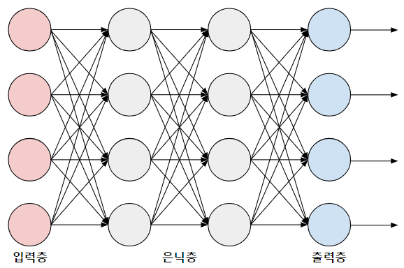
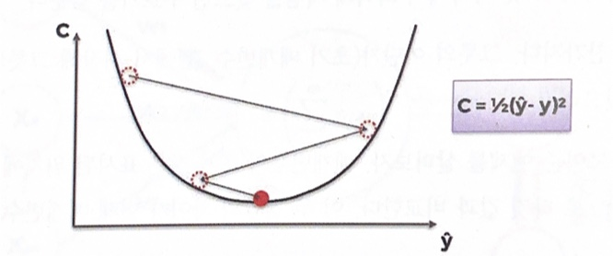

DQN(Deep Q-Learning)
===
 지금까지 배운 Q-Learning을 보면, 최단경로와 같은 문제 상황에 잘 적용해 사용할 수 있을 것 같지만 실제로는 여러 한계점이 존재합니다. 최단경로와 같은 상태와, 행동이 단순한 경우에는 Q-Learning이 잘 작동하지만, 실제의 상황, 보다 복잡한 상태와, 행동의 경우에는 예측을 제대로 하기도 힘들고, 자원소모가 매우 커지는 문제가 존재합니다. 또, 학습했던 상황이 아닌 새로운 상황에 놓이면 생각보다 정답을 찾아가기 힘들어합니다.<br>
 이러한 이유로 Q-Learning의 한계점을 보완한 DQN이라는 학습 방식이 제시되었습니다. DQN은 Q-Learning에 NN(Neural Network), Gradient Descent, Replay Buffer, Target Network와 같은 요소를 추가한 방식입니다. 각각의 방식을 아주 자세히 이해할 필요는 없지만, 대략적인 이해와, 구현 방법에 대해서 알아보겠습니다.<br>
## 1. Neural Network

<br>
Q-learning에서는 Q-table을 활용해서 행동을 선택합니다. 그러나 DQN에서는 NN을 통해 Q값을 예측하고 행동을 선택합니다. NN은 Layer와 Node로 구성되어 있습니다. 1개의 Layer에 다수의 Node가 존재합니다. 각각의 노드는 입력에 가중치가 곱해진 값을 input으로 받고, bias가 더해지고, 활성화 함수를 통과해 output이 출력됩니다. NN을 통과해서 output이 출력되는 과정을 순전파라고 합니다.<br>
실제 코드에서는 다음과 같은 형태로 구현됩니다.
```python
import tensorflow as tf
from keras import layers, Model
import numpy as np

class DQN(Model):

    def __init__(self, state_size, action_num, learning_r):

        super(DQN, self).__init__()
        self.d1 = layers.Dense(32, activation='relu', input_dim=state_size)
        self.d2 = layers.Dense(16, activation='relu')
        self.d3 = layers.Dense(action_num, activation='linear')
        self.optimizer = tf.keras.optimizers.Adam(learning_r)
    
    def call(self, x):

        x = self.d1(x)
        x = self.d2(x)
        return self.d3(x)
```
```layers.Dense()```라는 코드가 Layer를 생성하는 함수입니다. 위 클래스에서는 총 3개의 Layer를 생성했고, self.d1은 입력층, self.d3는 출력층, self.d2는 은닉층입니다. ```layers.Dense()```에는 노드의 갯수, 활성화 함수의 종류를 입력해주어야하고, input의 size를 지정할 수 있습니다.<br>
추가적으로, 활성화 함수는 여러가지가 존재합니다. 제일 자주 사용하는 것이 ReLu 함수이고, Softmax 함수도 꽤 사용합니다. 
#### 이외에도 다양한(tanh, linear...) 활성화 함수가 존재하니 찾아보세요.<br>
## 2. Gradient Descent
<br>
경사하강법은 NN에서 역전파 할 때 사용되는 알고리즘입니다. 역전파를 하는 이유는 NN의 가중치를 업데이트 하기 위해서라고 간단하게 생각하시면 됩니다. NN의 가중치를 업데이트 하는 이유는 더 나은 에측을 하기 위해서입니다.<br>
역전파를 하며 우리는 NN의 최적의 가중치를 찾아야합니다. 최적의 가중치란 출력 결과와 실제 결과의 오차가 최소가 되는 지점입니다. 미적분시간에 최솟값을 찾는 방법을 생각해보면, 함수의 미분값이 0이 되는 지점이 최소(정확하게는 극소)이므로, 기울기가 0이되는 지점을 찾아가는 알고리즘이 경사하강법이라 생각하시면 됩니다.<br>
Tensorflow를 사용한 강화학습 코드에서는 다음과 같은 형태로 사용됩니다.
```python
with tf.GradientTape() as tape:                 #GradientTape 경사하강법 사용을 위해 생성
    q_val = self.model.call(states)             # q 값 계산
    loss = tf.keras.losses.mse(targets, q_val)  # 오차 계산

gradients = tape.gradient(loss, self.model.trainable_variables)             #Gradient 계산
optimizer = tf.keras.optimizers.Adam(self.learning_rate)
optimizer.apply_gradients(zip(gradients, self.model.trainable_variables))   #optimizer를 이용해 역전파 수행
```
경사하강법 알고리즘은 초기 위치 (x, f(x))에서 다음과 같은 알고리즘을 통해 이동해간다. $$x_{t+1} = x_t - \alpha \times f'(x_t) $$ 이때 alpha는 학습률입니다. 학습률은 적절한 크기를 선택해야합니다. 학습률이 너무 크면, 수렴하지 않을 수 있고, 너무 작으면 최솟값을 찾는데 걸리는 시간이 오래 걸립니다.<br>
경사하강법은 최소가 아닌 극소를 찾게 되거나, 접평면의 기울기가 0이 되는 지점에서 수렴하는 문제가 발생합니다.<br>
#### 이를 해결하기 위해 배치 경사하강법, 확률적 경사하강법과 같은 알고리즘도 존재하니 찾아보세요.<br>
## 3. Replay Buffer
```python
    def update_memory(self, n_state, reward, termi, action, state):

        self.memory.append((n_state, reward, termi, action, state))
```
replay buffer에 Agent는 학습 결과를 저장합니다. 버퍼에 저장되는 정보는 학습에 필요한 정보들이 저장됩니다.<br>
replay buffer를 사용하는 이유는, 한 번의 학습을 통해 얻은 결과를 버려버리는 것은 매우 비효율적입니다. 재사용하기 위해서 replay buffer를 사용합니다.<br>
정보를 재사용하면서, Agent는 샘플링의 다양성을 증가시켜 다양한 상황에 균일한 성능을 얻을 수 있습니다. 또한 연속되는 경험의 경우 높은 상관관계를 갖게 되는데, 독립성을 증가시키는 효과도 얻을 수 있습니다.<br>
```mini_batch = random.sample(self.memory, self.batch_size)```를 통해 replay buffer에서 batch의 크기만큼 랜덤 샘플링을 수행합니다.
## 4. Target Network
```python
loss = tf.keras.losses.mse(targets, q_val)
```
경사하강법 코드에서 오차를 계산하는 부분입니다. 오차를 계산하기 위해서는 예측값과 정답이 필요한데, 사실 정답을 몰라요.<br>
정답을 모르기 때문에 우리는 목표값을 사용해서 오차를 계산합니다. 목표를 정답을 간주해서 오차를 계산합니다.<br>
앞선 내용에서 q_val은 ```model.call```을 활용해 계산한다고 했습니다. 즉, NN을 통과한 q 값으로 예측한다는 것입니다. 그렇다면 목표는 어떻게 찾을까요?<br>
목표도 동일하게 NN을 통과시킨 결과값으로 계산합니다. 그런데 생각해보면, 예측값도 NN, 목표(정답)도 동일한 NN을 통과시키면 이렇게 하는게 맞나? 하는 의문이 들겁니다.<br>
당연히 문제가 발생하기 때문에 Target Network라는 개념을 도입합니다.<br>
주 네트워크를 예측과 목표에 동일하게 사용하면, 주 네트워크가 업데이트 될 때 마다 목표가 자주 바뀌게 되는 문제점이 발생합니다. 안정적인 목표가 존재하는게 학습의 안정성을 높이고 좋은 결과를 유도할 수 있기 때문에 우리는 Target Network라는 네트워크를 하나 더 만들어서, 업데이트 주기를 늘려 안정적인 목표를 제공헤야합니다.<br><br>
요약하자면, 주 네트워크는 매 학습마다 가중치가 업데이트 되지만, Target Network는 일정 주기로 가중치가 업데이트 됩니다. 이러한 과정을 통해 안정적인 목표를 기반으로 학습을 진행합니다.

## 5. 숙제
1. Neural Network와 Gradient Descent 부분에 보시면, ~~도 존재하니 찾아보세요. 라는 문장이 존재하는데, 실제로 찾아와보세요. 한 분당 합쳐서 5분 정도로 간단하게 본인이 찾은 내용에 대해 발표해볼까요?
2. Tensorflow를 통한 예제 코드를 실행해보기 위해선, Tensorflow를 설치해야겠죠?
```pip install tensorflow```를 터미널에 입력해서 설치해서 오시길 바랍니다.
