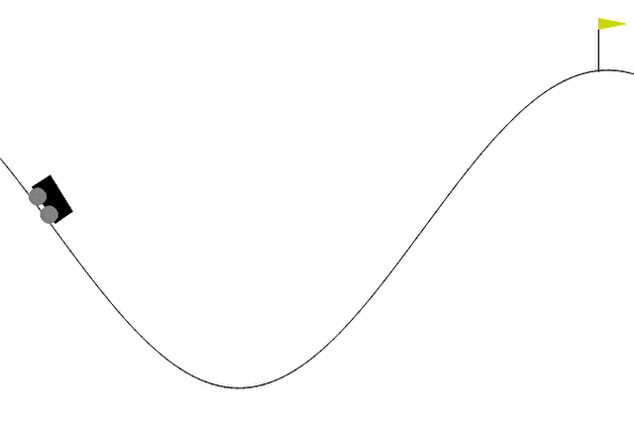

Mountain Car
=====
# 서론
1. 먼저 학습이 되는가에 대해 생각을 해 보았다. 앞선 문제들은 현재의 상태에서 바로 Reward를 부여하는것에 대해 문제가 없었는데, 이번 문제는 음의 방향으로 반동을 주었다가 양의 방향으로 올라가야 하는데, 이러한 움직임을 어떻게 학습시킬 지에 대해 고민해보았다. 즉, 어떻게 Reward를 부여할 것인가가 문제였다. 처음에는 위치에너지를 생각해서 ```Reward=(n_state[0]+0.5)**2 + n_state[1]```와 같이 높이와 속도에 따른 보상을 부여해보기로 했다. 그 후 다른 Reward 함수들을 적용해서 많이 시행 해 보았는데, 결과적으로 학습이 잘 되는거 같진 않았다.
2. 두 번쨰로 많이 했던 고민은, 자원에 대한 문제라고 할 수 있을 것이다. 처음에는 순전파와 역전파를 Tensorflow에 있는 ```model.predict(), model.fit()```을 사용했는데, ```epi``` 40정도에서 커널이 죽어버리는 문제가 항상 발생했다. 이후 클래스를 따로 만들어서 사용하니 이러한 문제는 해결 되었다.

# 본론

처음에 코드를 구현했을 때, Eps-Greedy를 구현을 잘못해서 엉뚱한 Action을 자꾸 선택해서 학습이 되지 않는 것 처럼 보였다. 문제가 되는 부분을 해결하니 손쉽게 학습이 되었고, 200 Step안쪽으로 성공하는 괜찮은 결과가 도출되었다.<br>

코드를 수정한 후 서론의 보상 부여식으로 학습을 진행해도 될 거 같지만, 더 나은 방법을 찾다가 아래 코드의 보상 부여식을 사용하였다.

```python
import numpy as np
import tensorflow as tf
from keras import layers, Model
import gymnasium as gym
import random

env=gym.make("MountainCar-v0")

class DQN(Model):

    def __init__(self, indim, outdim):
        super(DQN, self).__init__()
        self.d1=layers.Dense(32, activation='relu', input_dim=indim)
        self.d2=layers.Dense(16, activation='relu')
        self.d3=layers.Dense(16, activation='relu')
        self.d4=layers.Dense(outdim, activation='linear')
        self.optimizer=tf.optimizers.Adam(0.001)

    def call(self, x):
        x=self.d1(x)
        x=self.d2(x)
        x=self.d3(x)
        return self.d4(x)
    
class Agent():

    def __init__(self):
        self.input_size=2
        self.action_size=3
        self.eps=1.0
        self.eps_decay=0.98
        self.min_eps=0.1
        self.batch_size=64
        self.discount=0.99
        self.learning_rate=0.001
        self.memory=[]
        self.model=DQN(self.input_size, self.action_size)

    def update_eps(self):
        self.eps=max(self.eps*self.eps_decay, self.min_eps)

    def memory_update(self, n_state, action, reward, done, state):
        self.memory.append((n_state, action, reward, done, state))

    def get_act(self, state):
        if np.random.rand() < self.eps:
            return np.random.randint(0,3)
        else:
            return np.argmax(self.model.call(np.array([state])))
        
    def update_model(self):

        if len(self.memory)<1000:
            return

        if len(self.memory)>20000:
            del self.memory[0]

        if len(self.memory)>self.batch_size:

            mini_batch=random.sample(self.memory, self.batch_size)

            n_states=np.array([x[0] for x in mini_batch])
            actions=np.array([x[1] for x in mini_batch])
            rewards=np.array([x[2] for x in mini_batch])
            dones=np.array([x[3] for x in mini_batch])
            states=np.array([x[4] for x in mini_batch])

            q_val=self.model.call(states).numpy()
            n_q_val=self.model.call(n_states).numpy()

            targets=q_val.copy()
            targets[np.arange(len(rewards)), actions]=rewards+self.discount*np.max(n_q_val, axis=1)*(1-dones)

            with tf.GradientTape() as tape:
                q_val=self.model.call(states)
                loss=tf.keras.losses.mse(targets, q_val)

            gradients=tape.gradient(loss, self.model.trainable_variables)
            optimizer=tf.keras.optimizers.Adam(learning_rate=self.learning_rate)
            optimizer.apply_gradients(zip(gradients, self.model.trainable_variables))

model=DQN(2,3)
agent=Agent()
epi=500
suc=[]

for i in range(epi):

    state, _ = env.reset()
    agent.update_eps()
    max_pos=state[0]
    step=0
    done=False

    while not done and step<1000:

        action=agent.get_act(state)

        n_state, reward, done, trunc, _ = env.step(action)

        if n_state[0]>max_pos:
            max_pos=n_state[0]

        if done:
            reward=100
            suc.append(step)
        if action==2 and n_state[0]>state[0]:
            reward=3
        elif action==0 and n_state[0]<state[0]:
            reward=3

        agent.memory_update(n_state, action, reward, done, state)
        agent.update_model()

        state=n_state
        step+=1

    print(i+1, step, max_pos)

    if len(suc)>5 and sum(suc[-5:])/5<=200:
        agent.model.save_weights("./save_model/model", save_format="tf")
        break

env.close()
```

### 결과
```
44 301 0.5186913
45 261 0.5170992
46 242 0.51891655
47 202 0.51237524
48 163 0.50928134
49 148 0.5076828
50 171 0.5140109
```
50 Step에서 평균 step이 200이하가 되어 학습을 중단하고 인퍼런스를 실행해보기로 했다.<br>
그런데 학습을 멈추는 기준을 조금 더 어렵게 잡았어도 괜찮게 학습되었을 거 같다는 생각이 들긴 한다.

## Inferece
```python
env=gym.make("MountainCar-v0", render_mode='human')

model=DQN(2,3)
agent=Agent()
agent.eps=0.01
agent.model.load_weights('./save_model/model')

for i in range(5):

    state, _ = env.reset()
    max_pos=state[0]
    step=0
    done=False

    while not done:

        action=agent.get_act(state)
        n_state, reward, done, trunc, _ = env.step(action)

        if n_state[0]>max_pos:
            max_pos=n_state[0]
        if done:
            reward=100
        if action==2 and n_state[0]>state[0]:
            reward=3
        elif action==0 and n_state[0]<state[0]:
            reward=3

        state=n_state
        step+=1

    print(i+1, step)

env.close()
```
### 결과
```
1 126
2 127
3 126
4 125
5 126
```

120 step 정도에 성공하는 아주 좋은 결과가 나타난다.<br>
Render로 어떻게 움직이는지까지 보기로 했다.

### Render


앞으로 한 번 뒤로 한 번 다시 앞으로 약 3번의 움직임으로 목표에 잘 도달한다!!!

## 결론
1. 처음에 코드를 실패한 원인을 분석하여 다시 작성한 문서이다. 처음에 Eps-Greedy를 적용하는 코드에서 잘못한 점을 앞으로도 꼭 생각해서 같은 실수를 하지 않도록 반성해야 한다.
2. 보상을 어떻게 부여할 것인가? 라는 물음에 많은 생각을 해보았는데, 다른 사람들의 결과를 보고 조금 더 쉽게 생각해도 될 거 같기도 하고, 조금더 창의적으로 생각해야 하지 않을까 하는 생각이 든다.
3. 성공할 때의 감정은 몇 번을 반복해도 무뎌지지 않고 기쁘다. 이러한 느낌을 남들도 받을 수 있었으면 좋겠다는 생각을 하고, 다른사람에게 이 코드를 어떻게 이해시킬까 고민이 된다.