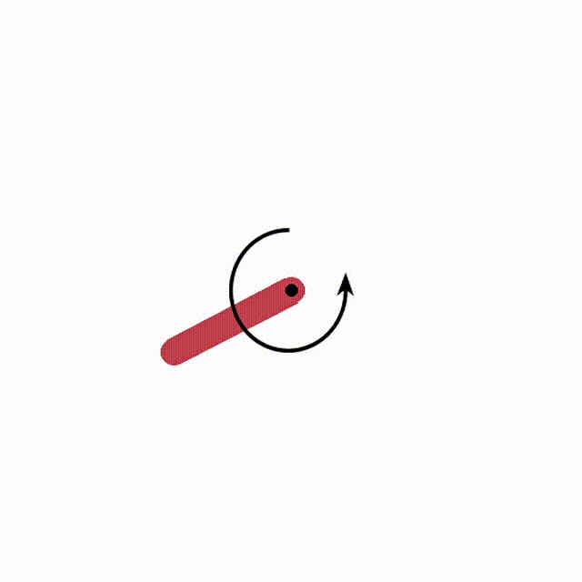

Inverted Pendulum
====
# 서론
1. Inverted Pendulum은 앞선 Mountain Car와 Cart Pole과는 다르게 Action Space가 Continuous하다. 그러므로 DQN에서 예측한 action이 -2와 2 사이의 한 값이 나와야 한다.
2. 처음에 Countinuous 한 Action을 Predict하는 DQN Class를 구현하려고 시도 했으나 결과적으로 실패했다. 그래서 차선책으로 선택한 것이 Discrete한 Action Space는 여려번 풀이 해 봤으므로, Discrete 한 Action으로 DQN 구현을 해보았다. 예측되는 문제는 아무래도 Continuous한 Action을 기반으로 만들어진 문제이므로, Discrete한 Action을 구현하면 Terminated할 확률이 낮아질거라 예상했다.
3. Reward 함수를 보면 성공할 경우 0이 되는데, Discrete하므로 특정 값 이상이면 성공하는 방향으로 생각해보았다.
4. Class 사용하기!!!!!
# 본론
## 

처음으로 시행해본 코드에서는 ```termination==True```인 경우에 ```reward=1000```으로 시행해보았는데, 문제가 발생했었다.
1. 임의로 Continuous한 Action space를 Discrete하게 변경해서 시행하니,  reward가 -0.01 이상으로 0에 가까운 값으로 출력되는 경우는 있었는데 정확히 0이 되는 경우가 없어 성공하지 못하는 결과를 출력했다.
2. 이러한 문제를 해결하기 위해 reward가 특정 값 이상이 될 경우 성공했다고 생각하고 학습하는 방향으로 수정해보기로 했다.

```python
### gravity = 10, state=41

import numpy as np
import tensorflow as tf
import random
from keras import layers, Model
import gymnasium as gym

env=gym.make('Pendulum-v1', render_mode='human')

class DQN(Model):

    def __init__(self, input_state, output_state):

        super(DQN, self).__init__()
        self.d1=layers.Dense(32, input_dim=input_state, activation='relu')
        self.d2=layers.Dense(16, activation='relu')
        self.d3=layers.Dense(16, activation='relu')
        self.d4=layers.Dense(output_state, activation='linear')
        self.optimizer=tf.keras.optimizers.Adam(0.001)

    def call(self, x):

        x=self.d1(x)
        x=self.d2(x)
        x=self.d3(x)
        return self.d4(x)
    
class Agent():

    def __init__(self):

        self.state_size=3
        self.action_size=41
        self.eps=1.0
        self.eps_decay=0.98
        self.eps_min=0.1
        self.batch_size=64
        self.learning_rate=0.001
        self.discount_factor=0.99
        self.memory=[]
        self.model=DQN(self.state_size, self.action_size)      

    def update_eps(self):

        self.eps=max(self.eps*self.eps_decay, self.eps_min)

    def eps_greedy(self, state):
        
        if np.random.rand()<self.eps:
            return np.random.uniform(-2,2)
        else:
            act=np.argmax(self.model.call(np.array([state])))
            return -2+act*0.1
    
    def append_sample(self, n_state, action, reward, termination, state):

        self.memory.append((n_state, action, reward, termination, state))

    def train_model(self):

        if len(self.memory)<1000:
            return

        if len(self.memory)>20000:
            del self.memory[0]

        if len(self.memory)>self.batch_size:

            mini_batch=random.sample(self.memory, self.batch_size)

            n_states=np.array([x[0] for x in mini_batch])
            actions=np.array([x[1] for x in mini_batch])
            rewards=np.array([x[2] for x in mini_batch])
            terminations=np.array([x[3] for x in mini_batch])
            states=np.array([x[4] for x in mini_batch])

            q_val=self.model.call(states).numpy()
            n_q_val=self.model.call(n_states).numpy()

            targets=q_val.copy()
            targets[np.arange(len(rewards)), actions]=rewards+self.discount_factor*np.max(n_q_val, axis=1)*(1-terminations)

            with tf.GradientTape() as tape:
                q_val=self.model.call(states)
                loss=tf.keras.losses.mse(targets, q_val)

            gradients=tape.gradient(loss, self.model.trainable_variables)
            optimizer=tf.keras.optimizers.Adam(learning_rate=self.learning_rate)
            optimizer.apply_gradients(zip(gradients, self.model.trainable_variables))

env.reset()
epi=100
agent=Agent()
memory_step=[]
count=0

for i in range(epi):
    
    state, _  = env.reset()
    agent.update_eps()
    termination=False
    step=0
    max_reward=-20
    
    while not termination and step<1000:

        action = agent.eps_greedy(state)
        n_state, reward, termination, _, _ =env.step([action])
        action=int((action+2)*10)

        if reward>=-0.015:
            termination=True
            memory_step.append(step)
            count+=1

        max_reward=max(reward, max_reward)

        agent.append_sample(n_state, action, reward, termination, state)
        agent.train_model()

        state=n_state
        step+=1

    print(i+1, step, max_reward)

agent.model.save_weights("./save_model/model", save_format="tf")
env.close()
print('성공횟수 : {}, 평균 step : {}'.format(count, (sum(memory_step)/count)))
```
### 결과
```python
###episode=100, g=10, num of action = 41
성공횟수 : 87, 평균 step : 138.183908045977
```
87%의 성공률에 평균 step도 138 정도로 양호하다고 생각해서 모델을 저장하고, Inference를 실행해보기로 했다.
## Inference
```python
agent.model.load_weights('./save_model/model')
agent.eps=0.01

for i in range(5):
    
    state, _  = env.reset()
    termination=False
    max_reward=-20
    step=0
    
    while not termination:

        env.render()

        action = agent.eps_greedy(state)
        n_state, reward, termination, _, _ =env.step([action])
        action=int((action+2)*10)

        if reward>=-0.015:
            termination=True

        max_reward=max(reward, max_reward)
        state=n_state
        step+=1

    print(i+1, step, max_reward)
```
### 결과
```
1 32 -0.010173404543845741
2 51 -0.01457047682185661
3 28 -0.011262265465701318
4 48 -0.009354138033847421
5 31 -0.008449544960297732
```
### Render


생각보다도 빠른 step 안에 성공하는 결과를 보였다.

# 결론
1. 처음에 Continuous한 Action으로 구현하지 못해서 바로 Discrete하게 Action을 나누는 방법은 한정된 시간 안에 성공하기 위한 좋은 선택이었다고 느낀다.
2. Discrete한 방법의 한계에서 오는 reward와 관련된 문제를 빠르게 인식하고 해결 했다는 점은 좋았다.
3. 그러나 근본적으로 Continuous한 문제를 Continuous하게 풀지 못한점은 반성해야하고, 방법을 알게 되면 개선해서 문제를 다시 풀어봐야겠다.
